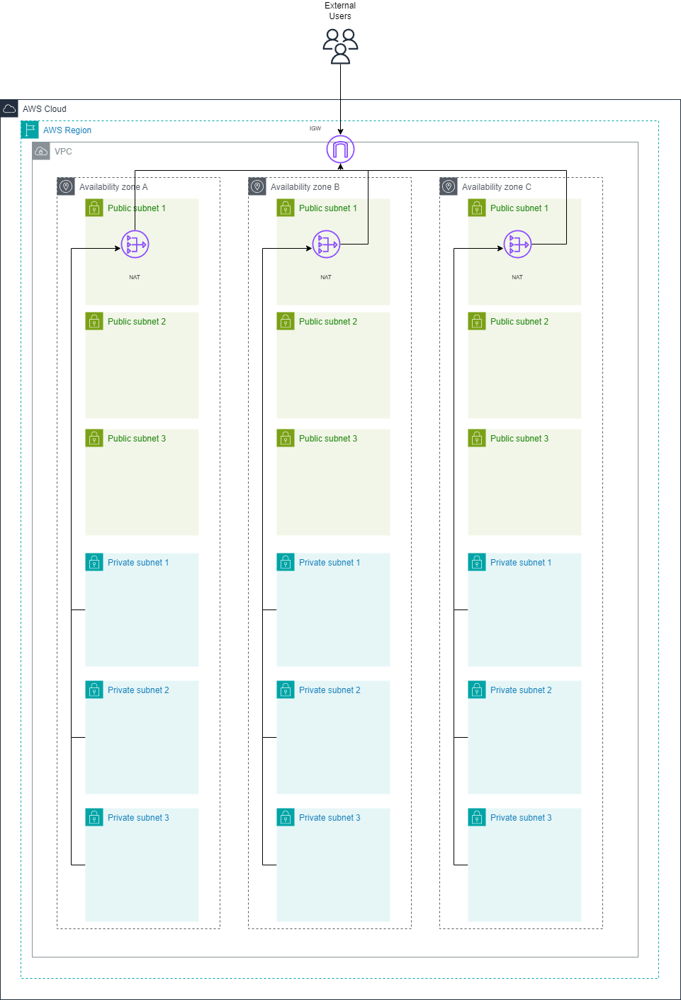

# Gestión de Infraestructura con Terraform

Este documento proporciona las instrucciones necesarias para configurar y gestionar la infraestructura en AWS utilizando Terraform.

## Herramientas necesarias

Para trabajar con este proyecto, necesitarás lo siguiente:

- **Terraform**
- **Cuenta AWS**: Acceso a una cuenta de Amazon Web Services para desplegar los recursos.
- **Credenciales AWS**:
  - **AWS Access Key**: Clave de acceso para tu cuenta de AWS.
  - **AWS Secret Key**: Clave secreta para tu cuenta de AWS.
  - **AWS Region**: Región de AWS donde se desplegarán los recursos.
  - **AWS Availability Zones**: Zonas de disponibilidad específicas dentro de la región seleccionada.

## Comandos Terraform para desplegar configuración

Para desplegar la infraestructura utilizando Terraform, sigue estos pasos en la terminal:

1. Inicializa Terraform y descarga los módulos necesarios:
   ```bash
   terraform init

2. Valida los archivos de configuración de Terraform para errores:
   ```bash
   terraform validate

3. Genera y muestra un plan de ejecución para los recursos que Terraform creará, modificará o destruirá:
   ```bash
   terraform plan

4. Aplica los cambios requeridos para alcanzar el estado deseado de la configuración:
   ```bash
   terraform apply

Para eliminar toda la infraestructura gestionada por Terraform (con precaución):
   ```bash
   terraform destroy
   ```
   
## Diagrama de Arquitectura

El siguiente diagrama representa la arquitectura de la infraestructura propuesta:




Este diagrama incluye los componentes principales que Terraform configurará en AWS, como instancias EC2, grupos de seguridad, redes VPC y más.

## Información adicional

Para más detalles sobre cómo modificar o ampliar esta configuración, consulta la documentación oficial de Terraform.